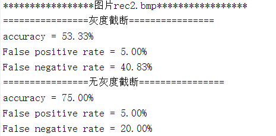

## 实验一：E_BLIND/D_LC 系统测试

> STU. NAME: 章雨婷
>
> STU. ID: 3170202582

### 1 实验目的

* 了解 E_BLIND/D_LC 系统的基本原理，理解 False Positive 和 False Negative 的概念，掌握 Linear Correlation 的计算

* 考察 E_BLIND/D_LC 系统检测值的分布，给出检测值的概率分布图或密度分布图

* 测试 8-bit 灰度值截断对系统检测准确率的影响

### 2 实验内容与要求

* 实现 E_BLIND/D_LC 系统

* 设计一张水印，嵌入强度 *α* = 1，使用该水印测试 E_BLIND/D_LC 系统应用于不同封面时的检测准确率，计算 False Positive/Negative Rate，并绘制如课本图 3.6 的检测值分布图或密度图。 要求封面数量不少于 40 张(建议使用课程提供的标准数据集作为测试封面)

* 设计不少于 40 张不同的水印, 使用固定的嵌入强度 *α* = 1，选择一张黑白像素比例(即灰度值接近 0 或 255 的像素数量占总像素数量的比例) 不高于 30% 的封面，测试不同的水印嵌入同一封面时 E_BLIND/D_LC 系统的检测准确率，计算 False Positive/Negative Rate，并绘制如课本图 3.6 的检测值分布图或密度图

* 选取一张黑白像素比例不低于 50% 的原始封面，重复子实验 3，比较检测准确率并分析原因

### 3 实验环境

MATLAB R2018a

### 4 实验过程与分析

#### 4.1 实现 E_BLIND/D_LC 系统

###### 4.1.1 E_BLIND 系统

参考课本知识，E_BLIND系统该采用单一水印模式$w_{r}$，是一个与图像大小相同的像素强度的矩阵。这个水印可以基于各种算法生成。消息模式$w_{m}$(对1位消息$m$进行编码)根据一位消息的内容不同变成$w_{r}$或$-w_{r}$，具体取决于$m$是等于1还是等于0。
$$
w_{m}=\left\{\begin{aligned}w_{r}&&if\ \ m\ =1\\-w_{r}&&if\ \ m\ =0\\\end{aligned}\right.\\
$$
在嵌入水印中，消息模式$w_{m}$由输入参数$\alpha$进行缩放，以生成添加的模式。$\alpha$值控制水印的可见性和鲁棒性。因此，E_BLIND算法具体如下：
$$
\begin{aligned}
w_{a}&=\alpha w_{m}\\
c_{w}&=c_{o}+w_{a}
\end{aligned}
$$
所以根据E_BLIND算法实现如下：

```matlab
function [result] = E_BLIND(Co, Wr, m, alpha)
result = Co;
[width, height] = size(Co);
% message 值判断
if m == -1
    Wm = -Wr;
else
    Wm = Wr;
end
% α=1
Wa = alpha * Wm;
% 添加水印
for i=1:width
    for j=1:height
        result(i,j)=Co(i,j)+Wa(i,j);
    end
end
```

###### 4.1.2 D_LC 系统

为了检测出水印信息，需要计算添加了水印的图像和水印的线性相关程度，即：

$$
\begin{aligned}
z_{lc}(c, w_{r})&=\frac{1}{N}c\cdot w_{r}=\frac{1}{N}\sum_{x,y}^{}c[x,y]w_{r}[x,y]\\
\end{aligned}
$$

N是图像包含的所有像素，如果$c=c_{o}+w_{a}+n$，则：

$$
\begin{aligned}
z_{lc}(c, w_{r})&=\frac{1}{N}(c_{o}\cdot w_{r}+w_{a}\cdot w_{r}+n\cdot w_{r})\\
\end{aligned}
$$

考虑到正常图片中$c_{o}\cdot w_{r}​$和$n\cdot w_{r}​$趋近于0，因为图片和水印都服从正态分布，所以$z_{lc}(c, w_{r}) \approx \pm \alpha w_{r}\cdot w_{r}​$ ，正负值依据m的值。

且图中没有水印时，$z_{lc}​$的绝对值趋近于零，所以可以定义一个阈值来判断图中是否加了水印：

$$
m_{n}=\left\{
\begin{aligned}
1&&if\ \ z_{lc}(c, w_{r})>\tau_{lc}\\
no \ watermark &&if\ \ -\tau_{lc}<z_{lc}(c, w_{r})<\tau_{lc}\\
0&&if\ \ z_{lc}(c, w_{r})<-\tau_{lc}\\
\end{aligned}\right.\\
$$

所以实现代码如下：


```matlab
function Zlc = D_LC(Cw, Wr)
[width, height] = size(Cw);
Zlc = double(0);
for i=1:width
    for j=1:height
          Zlc = Zlc + (double(Cw(i,j)) * double(Wr(i,j)));
    end
end
Zlc = double(Zlc/(width*height));
```

#### 4.2 水印检测系统应用于不同封面

首先，通过randn函数生成标准正态分布的伪随机数（均值为0，方差为1）作为水印模式$w_{r}​$，设定$\alpha=1​$ 且阈值 $Tlc=0.7​$。

同时构造函数用来计算False Positive/Negative Rate：

```matlab
function [accu, false_pos, flase_neg] = False_posneg(answer, predict)
false_pos = double(0);
flase_neg = double(0);
accu = double(0);
accu_num = 0;
[~, length] = size(answer);
false_pos_num = 0;
false_neg_num = 0;
for i = 1:length
    if answer(i) == predict(i)
        accu_num = accu_num + 1;
    else
        if (answer(i) == 1 || answer(i) == -1) && predict(i) == 0
            false_neg_num = false_neg_num + 1;
        end
        if (predict(i) == 1 || predict(i) == -1) && answer(i) == 0
            false_pos_num = false_pos_num + 1;
        end
    end
end
accu = double(accu_num)/length;
false_pos = double(false_pos_num)/length;
flase_neg = double(false_neg_num)/length;
```

这里用到的样本是未加水印的41张原图和分别加了消息值为+1和-1的水印的图片，一共123张图作为检测的样本。

最后得到的检测值分布图：


其检测准确率为96.75%，其中，False Positive Rate = 0.81%，False Negative Rate = 2.44%。

#### 4.3 水印检测系统应用于不同水印（ < 30%黑白像素比例）

首先找出黑白像素比例小于30%的图，这里选取了man.tiff来进行实验，得到如下检测值分布图：


其检测准确率为94.17%，其中，False Positive Rate = 0.83%，False Negative Rate = 5.00%。

#### 4.4 水印检测系统应用于不同水印（ > 50%黑白像素比例）

首先找出黑白像素比例大于50%的图，这里选取了man.tiff来进行实验，得到如下检测值分布图：


其检测准确率为53.33%，其中，False Positive Rate = 5.00%，False Negative Rate = 40.83%。

出现上图检测准确率偏低的原因是，图像黑白像素占比高，所以图像的像素分布和正常图片不同，不符合正态分布，所以图像矩阵和水印矩阵呈一定程度的线性相关，即$c_{o}\cdot w_{r}$的值不可忽略，所以检测结果准确率不高。

#### 4.5 8-bit 灰度值截断

首先理解8-bit 灰度值截断的含义，当图像添加了水印后，图像的像素点值超过了255或者小于0时，发生了8-bit 灰度值截断，之前实现的水印检测系统，控制图像增加水印后像素分布值在[0,255]之间，即发生了8-bit 灰度值截断。

这里，先对其中两幅图采用8-bit 灰度值截断和不采用8-bit 灰度值截断进行对比：


可以发现，自然图片（8.gif）的检测准确率变化不是特别大；但是，灰度值截断的情况下，像素分布不呈正态分布的图片（rec2.bmp/rec.bmp/rec_Hotelling.bmp）的检测准确率相比无灰度值截断变化很大。




为了验证这一猜想，同时进一步分析，这里对41张图片都进行了测试，为每一张图片增添不同的水印并对比实验，唯一变量是：是否采用8-bit 灰度值截断。计算每一张图片在采用8-bit 灰度值截断和不采用8-bit 灰度值截断时，水印检测的准确率和False Positive/Negative Rate。

以下是实验结果：


总体上来看，由于图片数据集大部分是自然图片，所以数据截断下的准确率总体上和无数据阶段的正确率差不多。但是图中也有波动点，其中有三个截断下与非截断相比波动变化大的图片来自于上述三张黑白像素比例超过50%的图。

**分析**：

产生这一现象的原因是，自然图片中，像素点呈正态分布，且分布均匀，所以发生灰度截断的像素点数量较小，所以下式中$w_{a}​$小部分值趋向于0，并不影响总体计算的结果。
$$
\begin{aligned}
z_{lc}(c, w_{r})&=\frac{1}{N}c\cdot w_{r}\\
&=\frac{1}{N}(c_{o}\cdot w_{r}+w_{a}\cdot w_{r}+n\cdot w_{r})\\
\end{aligned}
$$
但是，在黑白像素占比大的图片中，截断情况下，50%以上的像素点添加水印后并没有发生变化，也就是说$w_{a}$大部分值趋向于0，这种情况下，$c_{o}\cdot w_{r}$的值占比较大，$w_{a}\cdot w_{r}$的值几乎可以忽略，所以$z_{lc}(c, w_{r}) \approx \pm c_{o}\cdot w_{r}$ ，所以检测结果影响相差较大。

### 实验感想

实验整体实现算法不难，但是后面对8bit截断的实验过程中，为了不产生8bit灰度截断，一开始直接用int8转码了原图像，做出来的结果是灰度截断普遍正确率高于不灰度截断，后来才发现int8只考虑了像素点为0的情况的灰度截断，没有考虑到255的值，后面改成int16得到了结果。

实验过程中，对E_BLIND/D_LC算法有了更深刻的理解，收获颇丰。