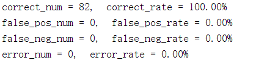
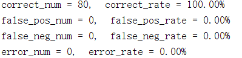
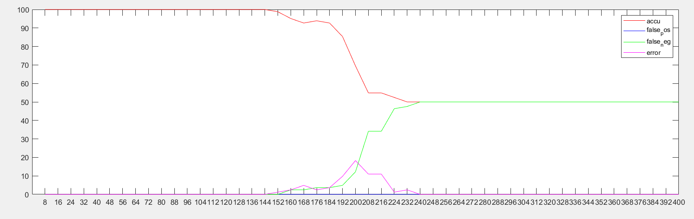
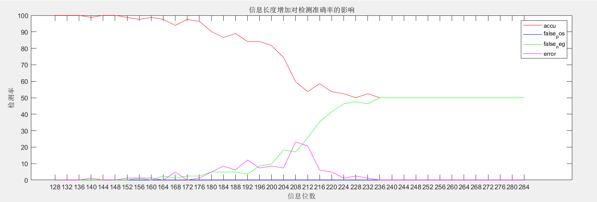

## 实验二：E_SIMPLE_8/D_SIMPLE_8 系统测试

> STU. NAME: 章雨婷
>
> STU. ID: 3170202582

### 1 实验目的

* 理解 E_SIMPLE_8/D_SIMPLE_8 系统的基本原理，掌握简单的多位信息水印技术


### 2 实验内容与要求

* 实现 E_SIMPLE_8/D_SIMPLE_8 系统
* 设计一张水印，嵌入强度 α = $\sqrt{8}​$，使用该水印测试 E_SIMPLE_8/ D_SIMPLE_8 系统应用于不同封面时的检测准确率，计算 False Positive/Negative Rate 和解码的准确率。要求封面数量不少于 40 张。False Positive/Negative Rate 的计算可以采取不同的原则。其中一种可以使用的原则是，预先设定一个固定的阈值，8 个检测值（detect value）中有 4 个超过了阈值，就认为存在水印，否则认为不存在水印。（也可以使用其他合理的原则，需要在报告中说明使用的是哪种原则）。准确率的计算，则是对确实添加了水印的图片，计算解码出来的信息的错误率。
* 设计不少于 40 张不同的水印, 使用固定的嵌入强度 *α* = $\sqrt{8}$，测试 E_SIMPLE_8/ D_SIMPLE_8 系统应用于同一封面时的检测准确率，计算 False Positive/Negative Rate
* 分析信息长度增加对检测准确率的影响

### 3 实验环境

MATLAB R2018a

### 4 实验过程与分析

#### 4.1 实现 E_SIMPLE_8/D_SIMPLE_8 系统

###### 4.1.1 E_SIMPLE 系统

E_SIMPLE 系统实现的是多位信息水印技术，在E_SIMPLE 系统中，需要加入的信息m不是一位信息而是多位（以八位为例）。

参考课本知识，E_SIMPLE系统该采用多个水印模式$w_{r1}，w_{r2}，…，w_{r8}$，是八个与图像大小相同的像素强度的矩阵。这个八水印基于同一种算法生成，设计不同的随机数种子。消息模式$w_{ri}$(对消息 $m$ 中第 $i$ 位消息进行编码)根据一位消息的内容不同变成$w_{ri}$或$-w_{ri}$，具体取决于$m[i]$是等于1还是等于0。
$$
w_{mi}=\left\{\begin{aligned}w_{ri}&&if\ \ m[i]\ =1\\-w_{ri}&&if\ \  m[i]\ =0\\\end{aligned}\right.\\
$$

然后将八个水印相加，合成成一张水印，然后对其进行归一化处理，得到最后的水印。

$$
\begin{aligned}
w_{tmp} &= \sum_{i}{w_{mi}}\\
w_{m} &= \frac{w_{tmp}}{s_{w_{tmp}}}\\
\end{aligned}
$$
在嵌入水印中，消息模式$w_{m}$由输入参数$\alpha$进行缩放，以生成添加的模式。$\alpha$值控制水印的可见性和鲁棒性。因此，E_SIMPLE算法具体如下：
$$
\begin{aligned}
w_{a}&=\alpha w_{m}\\
c_{w}&=c_{o}+w_{a}
\end{aligned}
$$
所以根据E_SIMPLE算法实现如下：

```matlab
% E_SIMPLE_8 --向图像中加入8位水印
% Arguments:
% Co     --待加入水印的图像
% m      --8位信息
% alpha  --加入水印强度
% seed   --随机数种子
function Cw = E_SIMPLE_8(Co, m, alpha, seed)
[width, height] = size(Co);
Wm = zeros(width, height);
Cw = zeros(width, height);
i = 1;
for i=1:8
    Wr = zeros(width, height);
    % rand生成Wr函数
    randn('seed',seed + i);
    Wr = randn(width, height);

    if m(i) == 1
        Wm = Wm + Wr;
    else
        Wm = Wm - Wr;
    end
end
% normalize
Wm_mean = mean(mean(Wm));
Wm = Wm - Wm_mean;
Wm_std = std2(Wm);
Wm = Wm / Wm_std;
% end
Cw = im2double(Co) + alpha * Wm;    
for i=1:width
    for j=1:height
        if Cw(i,j)>255
            Cw(i,j)=255;
        end
        if Cw(i,j)<0
            Cw(i,j)=0;
        end
    end
end

end
```

###### 4.1.2 D_SIMPLE 系统

为了检测出水印信息，需要计算添加了水印的图像和水印的线性相关程度，单个水印的线性相关程度计算如下：

$$
\begin{aligned}
z_{lc}(c, w_{ri})&=\frac{1}{N}c\cdot w_{ri}=\frac{1}{N}\sum_{x,y}^{}c[x,y]w_{ri}[x,y]\\
\end{aligned}
$$

对八个水印分别进行计算，这里计算第$i$个水印包含的$m[i]$值情况，N是图像包含的所有像素，$c=c_{o}+w_{a}+n$，则：


$$
\begin{aligned}
z_{lc}(c, w_{ri})&=\frac{1}{N}(c_{o}\cdot w_{ri}+w_{a}\cdot w_{ri}+n\cdot w_{ri})\\
&=\frac{1}{N}(c_{o}\cdot w_{ri}+\alpha \cdot \sum_{j=1}^{8}{w_{mj}}\cdot w_{ri}+n\cdot w_{ri})\\
\end{aligned}
$$

考虑到正常图片中$c_{o}\cdot w_{mi}$和$n\cdot w_{mi}$趋近于0，同时，包含不同信息的水印之间几乎是线性无关的，即：

$$
\begin{aligned}
w_{mi} \cdot w_{mj} \approx 0 (i \neq j)\\

\end{aligned}
$$

所以$z_{lc}(c, w_{ri}) \approx \pm \alpha w_{ri}\cdot w_{ri}$ ，正负值依据m的值。

且图中没有水印时，$z_{lc}​$的绝对值趋近于零，所以可以定义一个阈值来判断图中是否加了水印：

$$
m_{n}=\left\{
\begin{aligned}
1&&if\ \ z_{lc}(c, w_{r})>\tau_{lc}\\
no \ watermark &&if\ \ -\tau_{lc}<z_{lc}(c, w_{r})<\tau_{lc}\\
0&&if\ \ z_{lc}(c, w_{r})<-\tau_{lc}\\
\end{aligned}\right.\\
$$

对八个信息都做以上处理，就能得到实验结果。

所以实现代码如下：


```matlab
% D_SIMPLE_8 --向图像中加入8位水印
% Arguments:
% Cw     --已加入水印的图像
% seed   --随机数种子
function m = D_SIMPLE_8(Cw,seed)
[width, height] = size(Cw);
i = 1;
Wr = zeros(width, height);
m = zeros(1,8);
for i = 1:8
    randn('seed',seed + i);
    Wr = randn(width, height);
    j = 1;
    k = 1;
    product = 0;
    product = product + sum(sum(im2double(Cw).*Wr));
    m(i) = double(product/(width*height));
    if m(i) > 0.1
        m(i) = 1;
    elseif m(i) < -0.1
        m(i) = 0;
    else
        m(i) = 2;
    end
end
```

#### 4.2 水印检测系统应用于不同封面

这里用到的样本是未加水印的41张原图和分别加了消息（8位）的水印的图片，一共82张图作为检测的样本。对False Positive/Negative Rate 的计算采用的原则是，预先设定一个固定的阈值，8 个检测值（detect value）中有 4 个超过了阈值，就认为存在水印，否则认为不存在水印，如下：

```matlab
% 对于添加水印的结果进行检测
predict = D_SIMPLE_8(Cw, seed);
disp(predict);
if predict == m
	correct_num = correct_num + 1;
elseif length(find(predict==2)) >= 4 % 超过四位即认为不存在水印
	false_neg_num = false_neg_num + 1;
else
	error_num = error_num + 1;
end
% 对于未添加水印的结果进行检测   
predict = D_SIMPLE_8(c, seed);
disp(predict);
if length(find(predict==2)) >= 4 % 超过四位即认为不存在水印
	correct_num = correct_num + 1;
else
	false_pos_num = false_pos_num + 1;
end 
```

准确率的计算，则是对确实添加了水印的图片，计算解码出来的信息的错误率。

最后得到的检测准确率：



其检测准确率为100%，其中，False Positive Rate = 0%，False Negative Rate = 0%。

#### 4.3 水印检测系统应用于不同水印

不同水印可以通过设置seed值来进行改变：

```matlab
for i = 1:40
    m = randi([0,1],[1,8]);
    
    Cw = E_SIMPLE_8(c, m, alpha, seed * (i - 1));
    predict = D_SIMPLE_8(Cw, seed * (i - 1));
    ……
    predict = D_SIMPLE_8(c, seed * (i - 1));
    ……
   
end
```

这里选取了man.tiff来进行实验，得到如下检测准确率：



其检测准确率为100%，其中，False Positive Rate = 0%，False Negative Rate = 0%。

#### 4.4 信息长度增加对检测准确率的影响

这里通过设置信息长度为 $8, 16,..., 400$ 来进行分析，每个信息都分别嵌入进41张图片中，包括图片原图41张，一共形成82张图片，对其进行水印检测，得到该信息长度下，水印检测的准确率并进行对比。

实验结果如下：



横坐标为信息位数，纵坐标为检测率。

可见信息长度增加，检测的准确率会降低。

**分析**：

产生这一现象的原因是，随着信息长度的增加，需要的水印个数也会增加，由于图片大小的限制，生成的正态分布的水印很难做到线性无关。
$$
\begin{aligned}
z_{lc}(c, w_{ri})&=\frac{1}{N}(c_{o}\cdot w_{ri}+w_{a}\cdot w_{ri}+n\cdot w_{ri})\\
&=\frac{1}{N}(c_{o}\cdot w_{ri}+\alpha \cdot \sum_{j=1}^{len}{w_{mj}}\cdot w_{ri}+n\cdot w_{ri})\\
\end{aligned}
$$

在上面的式子中，包含不同信息的水印之间并不是完全线性无关的，即：

$$
\begin{aligned}
\sum_{j=1}^{len} w_{mj} \cdot w_{mi} \neq 0 (i \neq j)\\
\end{aligned}
$$

所以$z_{lc}(c, w_{ri}) \approx \pm \alpha w_{ri}\cdot w_{ri} + \sum_{j=1}^{len} w_{mi} \cdot w_{mj}$ ，所以会对值产生一定的影响，使检测值低于阈值从而判定为水印不存在。

同时可以注意到error rate在信息长度到达128~248时，有一个先增后减的状态如下图。



这是因为刚开始不同水印对其影响较小，但并没有超过设定有无水印的判断个数，造成了判断有水印但是信息提取出错，所以error rate增加，到后期检测值全部趋向于0，有水印的图片也被判断为无水印，所以error rate为0但是false negative rate 增加。

### 实验感想

实验过程中巧妙运用了seed来控制随机数种子来控制变量，相较于上一个实验，不需要存储水印信息，使实验更加方便。

这个实验相当于是对上一个实验的扩展，将嵌入一位信息扩展为8位甚至更多，区别在于不同的信息生成的水印之间不一定能做到完全线性无关，所以互相会有一定的影响，使检测值超过阈值。

实验过程中，对E_SIMPLE算法有了更深刻的理解，收获颇丰。