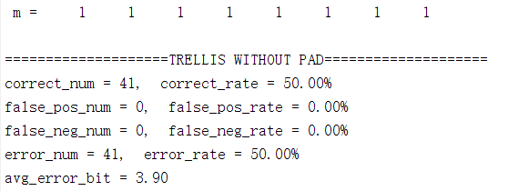

## 实验三**: E_BLK_8/D_BLK_8** 系统测试

> STU. NAME: 章雨婷
>
> STU. ID: 3170202582

### 1 实验目的

* 了解 E_BLK_8/D_BLK_8 系统的基本原理
* 了解 Hamming Code 和 Trellis Code 的工作原理
* 掌握 Correlation Coefffficient 的计算


### 2 实验内容与要求

* 实现基于 E_SIMPLE_8/D_SIMPLE_8 系统的 E_BLK_8/D_BLK_8 系统。要求使用 Correlation Coefffficient 作为检测值。 
* 设计一张水印，选择嵌入强度 *α* = *√*8，使用该水印测试基于 E_SIMPLE_8/ D_SIMPLE_8 系统的 E_BLK_8/D_BLK_8 系统应用于不同封面时的检测准确率。要求封面数量不少于 40 张。 
* 实现基于 Hamming Code 或 Trellis Code 的 E_BLK_8/D_BLK_8 系统
* 使用固定的水印和固定的嵌入强度，测试基于 Hamming Code 或 Trellis Code 的 E_BLK_8/D_BLK_8系统应用于不同封面时的检测准确率。这里 *α* 取值根据所采用的 Hamming Code 或 Trellis Code编码方式选定。比较在信息末尾添加两个 0 比特是否有助于提高检测的准确率，如果可以，请解释原因
* 比较基于不同系统，E_SIMPLE_8/D_SIMPLE_8 和（基于 Hamming Code 或 Trellis Code 的) E_BLK_8/D_BLK_8 系统的检测准确率，试分析原因

### 3 实验环境

MATLAB R2018a

### 4 实验过程与分析

#### 4.1 实现基于 E_SIMPLE_8/D_SIMPLE_8 系统的E_BLK_8/D_BLK_8 系统

###### 4.1.1 E_BLK_8 系统

D_BLK检测系统主要分为三步：

* 从未添加水印的图像$c_{o}$中提取出mark标记$v_{o}​$
* 在标记空间中选择一个新的向量$v_{w}​$，这个向量接近提取的标记，但在检测区域内
* 将$v_{w}$映射到图像空间中，得到带有水印的作品$c_{w}$

为了从图像中提取出水印，需要把图像分割成8x8的小块，然后将每个小块叠加并取平均值得到mark标记$v$：
$$
\begin{aligned}
v[i,j]&=\frac{1}{B} \sum_{x=0}^{ \frac{width}{8}}\sum_{y=0}^{ \frac{height}{8}}{c[8x+i,8y+j]}\\

\end{aligned}
$$
其中B为分割出的block数量，width和height分别是原图像的宽和高。

同时，根据消息每一位的值，生成相应8x8的水印：
$$
w_{mi}=\left\{\begin{aligned}w_{ri}&&if\ \ m[i]\ =1\\-w_{ri}&&if\ \  m[i]\ =0\\\end{aligned}\right.\\
$$

然后将八个水印相加，合成成一张水印，然后对其进行归一化处理，得到最后的水印。

$$
\begin{aligned}
w_{tmp} &= \sum_{i}{w_{mi}}\\
w_{m} &= \frac{w_{tmp}}{s_{w_{tmp}}}\\
\end{aligned}
$$
在嵌入水印中，消息模式$w_{m}​$由输入参数$\alpha​$进行缩放，以生成添加的模式。$\alpha​$值控制水印的可见性和鲁棒性。因此，得到的mark标记向量如下：
$$
\begin{aligned}
w_{a}&=\alpha w_{m}\\
v_{w}&=v_{o}+w_{a}
\end{aligned}
$$
将$v_{w}​$映射到图像空间的过程中，需要生成一个基于原图的图像$c_{w}​$，这里采用简单的把8x8矩阵映射到原图大小的空间中，方法如下：

$$
\begin{aligned}
c_{w}[x,y]=c_{o}[x,y]+(v_{w}[x \% 8,y\% 8]-v_{o}[x \% 8,y\% 8])\\
\end{aligned}
$$

这一步保证了当检测器对$c_{w}$应用提取函数时，结果是$v_{w}$，水印将被检测到。

所以根据E_BLK_8算法实现如下：

```matlab
% E_BLK_8_Simple -- 将编码的8位信息嵌入到基于块的水印中
% Arguments:
% Co -- 待加水印的图片
% m -- 8位信息
% alpha -- 嵌入强度
% seed -- 随机数种子
function Cw = E_BLK_8_Simple(Co, m, alpha, seed)
[height, width] = size(Co);
Co = im2double(Co);
% Simple modulate
Wm = zeros(8, 8);
for i=1:8
    Wr = zeros(8,8);
    % rand生成Wr函数
    randn('seed',seed + i);
    Wr = randn(8,8);

    if m(i) == 1
        Wm = Wm + Wr;
    else
        Wm = Wm - Wr;
    end
     
end

% normalize
Wm_mean = mean(mean(Wm));
Wm = Wm - Wm_mean;
Wm_std = std2(Wm);
Wm = Wm / Wm_std;
% end

% Extract Mark
vo = zeros(8,8);
n = zeros(8,8);
temp = 0;
for i=1:height
    for j=1:width
        index_i = mod(i-1,8) + 1;
        index_j = mod(j-1,8) + 1;
        vo(index_i, index_j) = vo(index_i, index_j) + double(Co(i,j));
        n(index_i, index_j) = n(index_i, index_j) + 1;
    end
end
vo = double(vo)./double(n);

% MixBlind
vw = zeros(8,8);
vw = double(vo) + double(alpha * Wm);

% InvExtractMark
nvo = zeros(8,8);
n = zeros(8,8);
for i=1:height
    for j=1:width
        index_i = mod(i-1,8) + 1;
        index_j = mod(j-1,8) + 1;
        nvo(index_i, index_j) = nvo(index_i, index_j) + double(Co(i,j));
        n(index_i, index_j) = n(index_i, index_j) + 1;
    end
end
delta = zeros(8,8);
delta = double(n).*vw - double(nvo);
Cw = zeros(height, width);
for i=1:height
    for j=1:width
        index_i = mod(i-1,8) + 1;
        index_j = mod(j-1,8) + 1;
        oldPixel = double(Co(i,j));
        newPixel = double(Co(i,j)) + double(delta(index_i,index_j))./double(n(index_i,index_j));
        if newPixel > 255
            newPixel = 255;
        end
        if newPixel < 0 
            newPixel = 0;
        end
        Co(i, j) = newPixel;
        n(index_i,index_j) = n(index_i,index_j) - 1;
        delta(index_i,index_j) = delta(index_i,index_j) - (Co(i,j) - oldPixel);
    end
end
Cw = Co;
```

###### 4.1.2 D_BLK_8 系统

D_BLK检测系统主要分为两步：

* 从加了水印的$C_{w}$中提取出mark标记$v$
* 用D_SIMPLE算法从提取出的mark中检测水印是否存在

为了从图像中提取出水印，需要把图像分割成8x8的小块，然后将每个小块叠加并取平均值得到mark标记$v$：

$$
\begin{aligned}
v[i,j]&=\frac{1}{B} \sum_{x=0}^{ \frac{width}{8}}\sum_{y=0}^{ \frac{height}{8}}{c[8x+i,8y+j]}\\

\end{aligned}
$$

其中B为分割出的block数量，width和height分别是原图像的宽和高。为了检测出水印信息，提取出的$v​$需要和之前定义的reference mark进行比较。

这里检测水印的过程中，D_BLK_8中运用的是相关系数检测，在相关系数检测前需要对矩阵进行减去均值处理，这是为了防止对某一矩阵进行数据加减影响检测值，同时，根据两个矩阵的大小对线性相关进行归一化处理，这样能防止对某一矩阵进行数据乘除影响检测值。这样的操作有很好的鲁棒性，能够抵抗图像亮度和对比度的变化。

相关系数检测定义如下：
$$
\begin{aligned}
z_{cc}(v, w_{r})&=\frac{\tilde{v} \cdot \tilde{w_{r}}}{\sqrt{(\tilde{v} \cdot \tilde{v})(\tilde{w_{r}} \cdot \tilde{w_{r}})}}\\
\end{aligned}
$$

其中$\tilde{v}​$和$ \tilde{w_{r}}​$经过了减去均值操作，相关系数检测可以看作$\tilde{v}​$和$ \tilde{w_{r}}​$归一化处理后的内积，这个可以简单理解为两个向量之间的夹角，也就是$\tilde{v}​$和$ \tilde{w_{r}}​$之间的夹角，所以：

$$
\begin{aligned}
-1 \leq z_{cc}(v, w_{r}) \leq 1\\
\end{aligned}
$$

于是和D_LC类似，检测结果设置阈值如下：

$$
m_{n}=\left\{
\begin{aligned}
1&&if\ \ z_{cc}(v, w_{r})>\tau_{cc}\\
no \ watermark &&if\ \ -\tau_{cc}<z_{cc}(v, w_{r})<\tau_{cc}\\
0&&if\ \ z_{cc}(v, w_{r})<-\tau_{cc}\\
\end{aligned}\right.\\
$$

所以实现代码如下：


```matlab
% D_BLK_8_Simple -- 使用相关系数检测基于块编码8位信息
% Arguments:
% Cw -- 加水印后的图像
% tcc -- 检测阈值
% seed -- 随机数种子
function m = D_BLK_8_Simple(Cw, tcc, seed)
[height, width] = size(Cw);
% Extract Mark
v = zeros(8,8);
n = zeros(8,8);
temp = 0;
for i=1:height
    for j=1:width
        index_i = mod(i-1,8) + 1;
        index_j = mod(j-1,8) + 1;
        v(index_i, index_j) =  double(v(index_i, index_j)) + double(Cw(i,j));
        n(index_i, index_j) = n(index_i, index_j) + 1;
    end
end
v = double(v)./double(n);
% SimpleDemodulate
Wr = zeros(8,8);
m = zeros(1,8);
for i = 1:8
    randn('seed',seed + i);
    Wr = randn(8,8);
    product = 0;
    product = double(product) + sum(sum(im2double(v).*Wr));
    m(i) = double(double(product)/(8*8));
    if m(i) > 0.1
        m(i) = 1;
    elseif m(i) < -0.1
        m(i) = 0;
    else
        m(i) = 2;
    end
end
% Simple modulate
Wm = zeros(8, 8);
for i=1:8
    Wr = zeros(8,8);
    % rand生成Wr函数
    randn('seed',seed + i);
    Wr = randn(8,8);

    if m(i) == 1
        Wm = Wm + Wr;
    else
        Wm = Wm - Wr;
    end
end
% corrcoef
mean_v = mean(v);
v = v - mean_v;
mean_Wm = mean(Wm);
Wm = Wm - mean_Wm;

vWm = sum(sum(v.*Wm));
vv = sum(sum(v.*v));
WmWm = sum(sum(Wm.*Wm));
ESSENTIALLY_ZERO = 0.0000001;
if abs(vv*WmWm) < ESSENTIALLY_ZERO
    cc = 0;
else
    cc = vWm / sqrt(vv*WmWm);
end
% disp(cc);
if cc < tcc
    m = zeros(1,8);
    m = m + 2;
end
```

#### 4.2 水印检测系统应用于不同封面

这里用到的样本是未加水印的41张原图和分别加了消息（8位）的水印的图片，一共82张图作为检测的样本。对False Positive/Negative Rate 的计算采用的原则是，预先设定一个固定的阈值，8 个检测值（detect value）中有 4 个超过了阈值，就认为存在水印，否则认为不存在水印，准确率的计算，则是对确实添加了水印的图片，计算解码出来的信息的错误率。

由于增加的消息可以有256种组合，所以对所有组合方式都进行测试，最后得到的检测结果如下：


* correct_num表示检测结果正确的个数
* false_pos_num表示检测结果假阳性的个数
* false_neg_num表示检测结果假阴性的个数
* error_num表示存在水印的图像中，信息提取错误的图像个数
* avg_error_bit表示在水印的图像中，信息提取错误的图像中，平均错误位数

#### 4.3 实现基于 Trellis Code 的 E_BLK_8/D_BLK_8 系统

###### 4.1.1 E_BLK_8_Trellis 系统

Trellis code 是一种纠错码，编码情况下可以看成一种状态机，课本上的图如下：


如果输入位是0，它从当前状态穿过细线并输出线上标记的四位数字。如果输入位是1，它将遍历粗线并输出线上标记的4位数字。因此，编码后，4位的信息将被转换为16位。

实现代码如下（仅包含Trellis code其余与SIMPLE相同）：

```matlab
% E_BLK_8_Trellis -- 将编码的8位信息嵌入到基于trellis code块的水印中
% Arguments:
% Co -- 待加水印的图片
% m -- 8位信息
% alpha -- 嵌入强度
% seed -- 随机数种子
function Cw = E_BLK_8_Trellis(Co, m, alpha, seed)
……
% Trellis modulate
Wm = zeros(8,8);
state = 0;
stateSystem = [[0,1];[2,3];[4,5];[6,7];[0,1];[2,3];[4,5];[6,7]];

for i=1:10
    Wr = zeros(8, 8);
    % rand生成Wr函数
    randn('seed',seed + state * 10 + i - 1);
    Wr = randn(8, 8);
    if i<=8 && m(i) == 1
        Wm = Wm + Wr;
        state = stateSystem(state+1, 2);
    else
        Wm = Wm - Wr;
        state = stateSystem(state+1, 1);
    end  
end
% normalize
……
% Extract Mark
……
% MixBlind
……
% InvExtractMark
……
```

###### 4.1.1 D_BLK_8_Trellis 系统

解码的过程就是找到通过最有可能的路径。最有可能的路径的特征是，接收到的向量与该路径的信息向量之间具有最高线性相关性或内积。

找到最有可能的路径就是通过Viterbi解码，为了解释解码算法，定义如下：

* $v$是需要解码的向量
* $w_{i,j}$是从状态图上状态$i$到状态$j$的路径上的reference mark
* $p[A...H]​$是八条路径的数组，$p[i]​$是最有可能到状态$i​$的路径
* $z[A...H]​$是八个内积，$z[i]​$是$v​$和$p[i]​$这条路径上reference mark的内积

最一开始，$p[A...H]$初始化为无路径，$z[A...H]$初始化为0，在第一次迭代中，计算$v$与从列0到列1的状态的转换相关的16个reference mark之间的内积。为了计算$v$与从列0的状态到列1的状态的路径之间的内积之和，新定义一个$z$变量，将与之对应转换路径的计算结果加对应的$z$上。

比较两条路径上的内积，选择内积大的那条路径，再继续进行计算，例子如下：
$$
\begin{aligned}
z[A]+v \cdot w_{A0,B1} \gt z[E]+v \cdot w_{E0,B1}\\
\end{aligned}
$$
那么选择路径A0到B1：
$$
\begin{aligned}
z[B] &\leftarrow z[A]+v \cdot w_{A0,B1}\\
p[B] &\leftarrow p[A]
\end{aligned}
$$

持续操作直到到达最后，得到的内积结果值是最高的，同时，这条路径就是解码结果。

实现代码如下（仅包含Trellis code其余与SIMPLE相同）：

```matlab
% D_BLK_TRELLIS_8 -- 使用相关系数检测基于trellis code块编码8位信息
% Arguments:
% Cw -- 加水印后的图像
% tcc -- 检测阈值
% seed -- 随机数种子
function m_best = D_BLK_8_Trellis(Cw, tcc, seed)
……
% Extract Mark
……
% TrellisDemodulate
lc0 = zeros(1,8);
lc1 = zeros(1,8);
lc0 = lc0 - 1;
lc0(1) = 0;
% temp = lc0(2);
m0 = zeros(8,8);
m1 = zeros(8,8);
stateSystem = [[0,1];[2,3];[4,5];[6,7];[0,1];[2,3];[4,5];[6,7]];
for i=1:10
    lc1 = zeros(1,8);
    lc1 = lc1 - 1;
    for state = 0:7
        if lc0(state + 1) ~= -1
            Wr = zeros(8, 8);
            % rand生成Wr函数
            randn('seed',seed + state * 10 + i - 1);
            Wr = randn(8, 8);
            lc = sum(sum(v.*Wr))/64;
            next = stateSystem(state+1, 1);
            if lc1(next+1) == -1 || lc1(next+1) < lc0(state+1) - lc
                lc1(next+1) = lc0(state+1) - lc;
                m1(next+1,:) = m0(state+1,:);
            end
            if i <= 8
                next = stateSystem(state+1, 2);
                if lc1(next+1) == -1 || lc1(next+1) < lc0(state+1) + lc
                    lc1(next+1) = lc0(state+1) + lc;
                    m1(next+1,:) = m0(state+1,:);
                    m1(next+1,i) = 1;
                end
            end
        end  
    end
    lc0 = lc1;
    m0 = m1;   
end
bestState = 0;
for state=1:7
    if lc0(state+1) > lc0(bestState+1)
        bestState = state;
    end
end
m_best = m0(bestState+1,:);
%TrellisModulate
Wm = zeros(8,8);
state = 0;
stateSystem = [[0,1];[2,3];[4,5];[6,7];[0,1];[2,3];[4,5];[6,7]];

for i=1:10
    Wr = zeros(8, 8);
    % rand生成Wr函数
    randn('seed',seed + state * 10 + i - 1);
    Wr = randn(8, 8);
    if i<=8 && m_best(i) == 1
        Wm = Wm + Wr;
        state = stateSystem(state+1, 2);
    else
        Wm = Wm - Wr;
        state = stateSystem(state+1, 1);
    end  
end

% corrcoef
……
```

#### 4.4 水印检测系统应用于不同封面以及PAD对比

上述实现的程序是基于8位信息的调制和解调制，当在信息末尾添加两个0比特，检测准确率对比如下：

例1：m = [1,1,1,1,1,1,1,1]




例2：m = [0,0,1,0,0,0,1,0]


例3：m = [0,0,1,0,1,1,0,0]


例4：m = [0,0,0,0,0,0,1,0]


**分析**：

产生这一现象的原因是，在信息末尾增加两个比特后，最后需要计算内积的路径扩展到了十位，其中最后两位是0，所以在构造$w_{m}$时，最后两个水印都是$-w_{r}$。由于这是已知条件，在最后计算内积时，正确的路径上的最后两位能够确保是正确的，也就是正确的路径上，计算最后两位内积时得到的结果必然是最大的。

如果前面8位数据中有解码错误偏离了正确路径，比如路径A前八位的的结果是$z_{A}$，路径B前八位的的结果是$z_{B}$，正确结果是路径A，但是$z_{B} \gt z_{A}$，这种情况下，计算最后两位的内积$z_{A2}$和$z_{B2}$，由于路径A的最后两位是正确的，所以$z_{A2} \gt z_{B2}$，这样能够消除A和B路径之间的微小差距，不会让程序误以为路径B是正确的。

因此，添加两位信息后，检测结果正确率得到很大的提升。


#### 4.5 比较E_SIMPLE_8/D_SIMPLE_8 和Trellis Code 检测准确率

由于m的信息有八位，一共有256种组合方式，所以测试两个系统对256种信息的检测准确率，结果如下：


可以看出，trellis code的检测准确率远远高于simple，这是因为trellis code有添加两位信息，相当于纠错码的存在（具体分析见4.4），能够在一定程度上纠正解码错误。


### 实验感想

实验过程中比较困难的是理解算法原理以及通过原理实现。

在Extract Mark的过程中，由于一开始没有注意到每次计算出一个新的Newpixel的时候，都要更新delta和n以及原图，所以导致最后计算结果错误，检测出来的cc和未添加水印的差不多。

第二点是TRELLIS CODE的实现，需要仔细分析每一步的初始化和值的变化。

实验过程中，对E_BLK，trellis code和Correlation Coefffficient 算法有了更深刻的理解，收获颇丰。