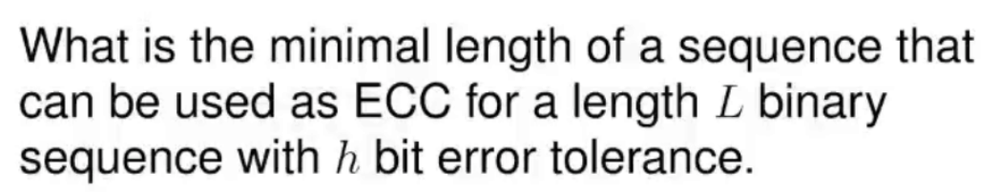
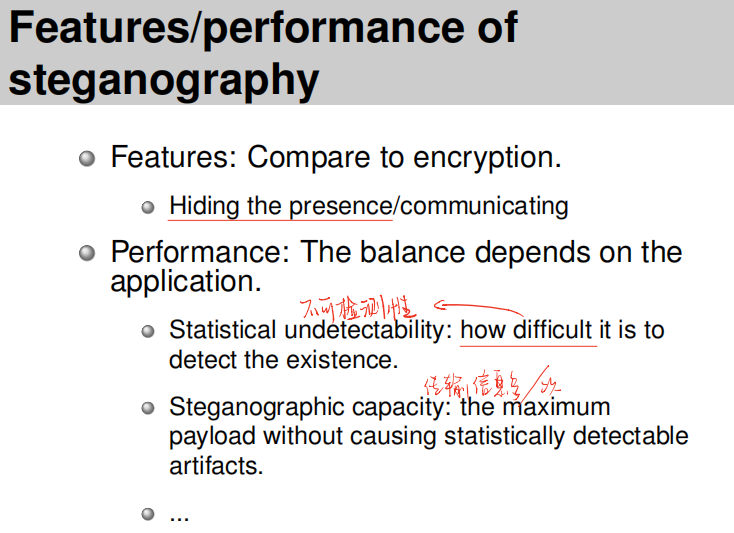
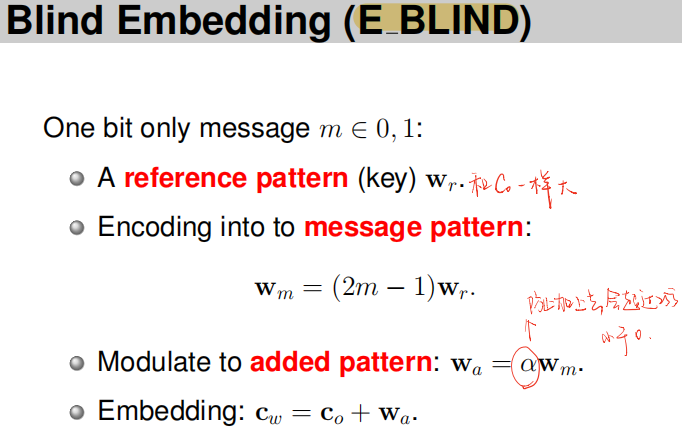
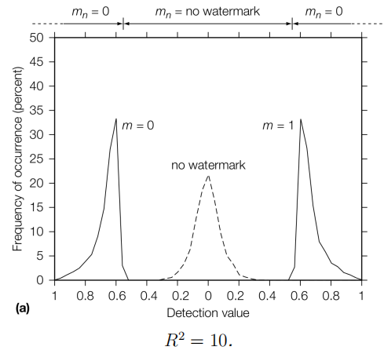
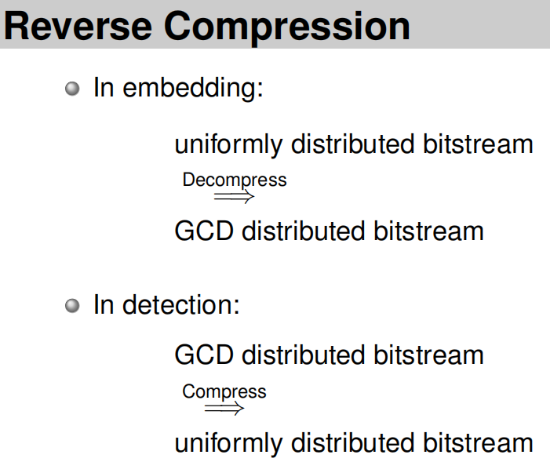

## 水印REVIEW

**上课强调的考点**

* 水印和work有关联，隐写术和work无关联

* 

* 看图，画fpr effectiveness merror区域

  

* 判断题如下图，fpr与编码方式无关

  

* 

* Trellis code

  

* 解释无交集原因

* 考试中可能会不是考计算而是考（对水印和work都用高斯白噪声，得到fpr曲线图，问图更适合描述随机水印还是随机work）

* effectiveness=100%不代表detector=100%，传输过程中会有噪声

* 给出几张performance图，分类robustness side information embed（哪个图的robustness比较好，给出直观解释包括大体画出投影点）

* 

* 考试会有LSB和QIM

* 

* 

* 

  

  

* 

  

  

  

  

  

  

  

### CHAPTER 1  **Introduction**

水印和隐写术的定义

四类信息隐藏

应用场景&为什么不用加密技术

### CHAPTER 2 **Applications and Properties**

1. Features/performance

****

2. 应用

* Watermark

  * Broadcast Monitoring （passive/active）

  * Owner Identification

  * Proof of Ownership （别人不能轻易移除，也不能轻易检测出来，eg. 公私钥）

  * Transaction Tracking（英国内阁那个例子）

  * Content Authentication（没有被篡改）

  * Copy Control（没有被刻录）

    

    解决盗版办法：水印 $\rightarrow$ 破解水印 $\rightarrow$ 申请专利

  * Device Control（和设备兼容，eg. 水印控制音画同步，interactive TV）

* Steganography
  * Dissidents（知道自己被监控）：加密（逮捕）；匿名发送（保护发送方）；隐写（benign）
  * Criminal（不知道自己被监控）：加密（推断同谋）；匿名发送（法律）；隐写（查封计算机）【更容易实现隐写术】

****

3. 属性

* Watermark

  * Embedding：fidelity；Data Payload

  * Detection

    * Blind/Informed（blind无原图，informed有原图）

    * false positive（关于pre，随机水印比随机work准确率高的原因：水印模式人为生成规律比较简单，work模式是自然界照片or图像，找模式规律比较难）

    * Robustness

      benign对应robustness，hostile对应security

  * Security

    * watermark角度

      Unauthorized removal: active attacks
      Unauthorized embedding: active attacks
      Unauthorized detection: passive attack

    * cover work角度

      Active attacks: modify the cover work.
      Passive attacks: do not modify ...

* Steganographic

  * Embedding（**考点：**和水印的区别，水印添加失败即失败，因为水印和work有关；隐写添加失败可以换一个work添加，因为隐写和work无关）

    capacity：放多容易被找到，放少效率不高

  * Detection：Steganalysis systems 比较适用于 informed

    targeted，flase alarm rate（水印里叫false positive rate）

  * Security，Stego Key（密钥长度不重要）

#### PRE

### CHAPTER 3 **Models of Watermarking**

**Secure Transmission**

* Passive: Aims at the message

  Message layer: cryptography

* Active: Aims at the transmission

  Transport layer: spread spectrum communication

****

**COMMUNICATION**

cover work可以视作三种存在：

* As noise

  informed —— 把原图也传输过去；

  blind —— E_BLIND/D_LC（算法原理：两个向量间隔进点积大；高维随机向量之间几乎垂直）

  * 复习：注意modulation的意思，表示把message变成物理信道上能走的信号

  * 

  * 

  * 

  * **考点** 看图，画fpr effectiveness merror区域

    

  * 为什么低频Wr effectiveness会变差：图像和噪音都是低频，Wr·Co变大

* As side information

  解决方案：寻找α范围使得effectiveness变为100%（**E_FIXED_LC**）

  

  **考点** fpr不会变，判断题如下图，fpr与编码方式无关

  

  强行改动c（会降低fidelity）

  fpr不会变为0

* The second message

  人看低频信息，机器看高频信息（不同频率上放不同信息达到Multiplexed Communications）

****

**Geometric**

Points in Space

* Media space
* Marking space（eg. 直方图）

用region表示概念：

****

Marking space的方法（降低计算复杂度，效率更高，更小的reference key）

算法：E_BLK/D_CC

BLK：

D_CC：

embed：

****

三种检测方法：

* Linear correlation

  

* Normalized correlation

  

* Correlation coefficient

  

### CHAPTER 4 **Basic Message Coding**

主要讲多位message

Source coding: maps messages into sequences of **symbols**

Modulation: maps sequences of symbols into physical signals

不同位之间的W最好正交，同一位中不同信息之间负相关

减少多位信息检测时的比较次数：

****

添加多个水印的分布方式

* Time-division multiplexing：不同时间段

* Space-division multiplexing：同一张图不同位置

* Frequency-division multiplexing：不同频段（低频——高频）

* **Code-division multiplexing**

  

  要求：不同行之间线性无关，同一行之间负相关

  通过检测时，6种8bit信息放入2000张图中，会有检测错误，原因是不同8bit信息之间有相关性
  
  解决方案：汉明码，ECC
  * Increase the length of sequence
    

  * Expand the Alphabet（eg. Trellis Code）

    编码：

    

    解码和纠错：

    

    会在trellis code后pad两位用来降低FPR

由于trellis code的纠错功能可能导致无水印的图也被认为有水印，所以采用

* **Valid Messages**

  前16位数据，后9位校验，FPR降低为原来的$\frac{1}{2^{9}}$

****

Normalized Correlation

信息长度L很大时表现差，因为Znc和L有关（前面有个 $\frac{\alpha}{\sqrt8}$ 就是对值做归一）

  

Geometric Interpretation

Linear correlation：

  

Normalized Correlation **考点** 解释原因

所以需要用到**Reencode**

不单独比较m中每一个bit而是比较整个m

### CHAPTER 5 Watermarking with Side Information

这章主要研究如何平衡fidelity和robustness

之前研究过控制α的取值范围来保证fidelity：E FIXED LC，但是只适用于Zlc

znc锥形空间：

Zcc上的应用：

第一种类型，直接垂直映射到距离最近的检测边界中

表现情况有两点不好（1. 不同位置抗噪声干扰能力不同 2. β增加，会时夹角变小，在靠近顶点附近的点离边界近，细微扰动就不能被检测到）

检测值的大小都差不多，因为都是通过最短距离直接映射到边界，所以检测值一样

第二种方法，添加噪音后，直接计算噪音应该控制的范围大小（和Zlc的计算α类似）

检测值分布比较宽，检测值越小表示越靠近边界的区域，也就是抛物线图中右上角的位置（轻微扰动会变成no watermark）

**考点** 给出几张performance图，分类robustness side information embed（哪个图的robustness比较好）

****

主要讨论如何将原图（cover work）利用成side information【可以增加fidelity】

Dirty paper code：原来时code words，现在是一组code words。message每一位对应的可以有多种表示方法，根据cover work来选择最适用的（需要改动最小也就是和message最线性相关的一个code word）

由于阴影区域变多，所以fpr可能会增加，解决方案是减小每一个锥形区域的夹角

另一个缺点是，需要遍历每一个code word效率不是很高

**Least signifificant bit (LSB)**

优点：payload高，而且对1bit的信息传输fidelity好

缺点：robustness低；fpr高【解决方案是ECC；校验码，eg. pad，valid message】

**Quantization Index Modulation**

**Lattice Codes**

### CHAPTER 6 **Practical Dirty-Paper Codes**

权衡fidelity和robustness

同时，如果只修改平行Wr部分，fidelity会比较低，如下：

所以，点积过后经过lattice code修改后的值需要重新映射到原来的向量上（也就是平行于Wr的部分通过lattice code进行更改，而垂直Wr的部分保留）

同样，信道传输过程的值会取round，上面得到的（7.36,4.48）会被重新round成（7，4）后仍旧是7，并没有变成8。解决方案：高维度空间下这种影响会比较小。

### CHAPTER 9 **Robust Watermarking**

QIM难以抵抗亮度伸缩等变化

下图，左右不对称的原因是大于1的时候会溢出：

解决措施：固定长度的情况下改变夹角

**考点** 2**-Dimensional Case**

### CHAPTER 10 **Watermark Security**

主要讲了给定原图和加水印的图的情况下，如何构造一个图来做到对称，无法分清原图是哪一张。

目标：

**A Naive Solution**

但是这种情况下的Cf几乎等于0，fidelity很差

**A Better Solution**

这样得到的水印添加Wf具有一定原图性质，所以需要添加噪声

解决办法是直接往加了原水印的图中添加噪声：

应对上述方法，可以在水印和原图中构建一种关联，比如MD5

****

下图是一种分析，在寻求与Cd和Cf极大线性相关的同时，寻求Cf和Wf线性相关最小，这两个要求是互相有关联的，可以使<Cd，Wf>的值达到-α

****

补充mse和DCT

* mse判断两张图的相似性：

* DCT

  分割，首先将图像分割成8x8或16x16的小块；
  DCT变换，对每个小块进行DCT变换；
  舍弃高频系数（AC系数），保留低频信息（DC系数）。高频系数一般保存的是图像的边界、纹理信息，低频信息主要是保存的图像中平坦区域信息。

  

### CHAPTER 11 **Content Authentication**

主要讲如何看出work被改动了，以及添加水印后复原

将图像分割为两半（一块计算MD5一块添加MD5）用SHA和MD5的方法难以抵抗图像distortion

**Erasable Watermarks**

普通的水印添加会溢出。

解决方案1：溢出后直接反向（eg. 256->-1）。缺点是，影响fidelity，同时是一种informed 方式，需要side information

解决方法2：

这里利用了人眼感知，取相邻的像素点，用插值添加水印

更多symbol的情况下：

**核心思想** 这里放大三倍的原因是，能够做逆变换，从添加水印的图像中重新提取出原图

同时，如果无法放入信息（也就是三倍差值超出阈值），修改像素差为2n+1的倍数，修改的值作为后续值，放入图像。MD5信息读完后读修正信息。

这个方法的缺陷：图像的大小或图像数量是有限的，映射要求一对一，给一个message，一边是Co一边是Cw，难以同时hold（两个同样大小有限集难以映射到一个大小中）

### CHAPTER 12 **Steganography**

主要讲水印添加技术

根据cover work分类：

* Preexisting, and will not be modified: 

  cover lookup. 已有，不改（eg. 不同work代表不同m，缺点：payload低）

* Generated, and will not be modified: 

  cover synthesis. ⽣成，不改（eg. 一本书中不同单词代表不同m，缺点：表达范围受限，解决方案code book）

* Preexisting and modified: 

  cover modification. 已有，改

  * 方法1：LSB，相邻两个像素为一个bin，同一个bin之间交换

    

  * OutGuess，每个bin内变化的值后续都要矫正回来

    

    embed比例不能过高：

    

  * Model-Based Steganography，（这一种方法和上一种方法可以看作trellis code和汉明码之间的区别，这种方法将数据位和校验位放在一起，而上一种分离）用概率来表示编码的组成

    

    

    后续解压用到的方法是Arithmetic Decompress：

    

    

****

**Embedding Effificiency**

LSB的效率：

概率分布均匀的情况下，需要的改动就多，ee就小

* Jsteg：相邻两个之间改动，缺点是造成bin内变得平均

* F3

  

  

  但是F3造成0变多

* F4

  

  

**Matrix Encoding** F5算法

前面数学推导不会考

****

**Matrix Embedding** 算法

**考点** 

P代表排列，重组v，能改的部分放到一起，不能改的置0

**Perturbed Quantization**

### CHAPTER 13 **Steganalysis**

一些简单的概念性的知识（感觉不会考）

False alarm ==== False positive

False detection ==== False negative

**Targeted Steganalysis** 针对某种算法寻找技术 （eg. LSB 直方图）

**Blind Steganalysis** 机器学习数据集

**Stego Key** 和work大小有关

**Forensic Steganalysis** 窃听

**Cover Work Choosing** 图需要大（能放足够多信息）；但不能过大（会被检测出原图）

****

一些检测隐写术的技术

**Sample Pairs Analysis**

注意：

尽量增多W+Z，方法是选取临近的点对

**Blind Steganalysis Using Calibration**

隐写：尽量选择噪声多的work来隐写

检测隐写：也可以通过添加噪声来设置样本，用分类器进行学习分类